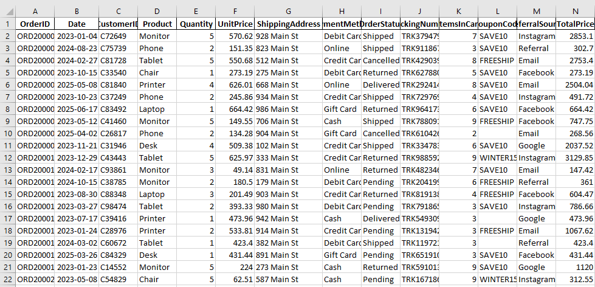
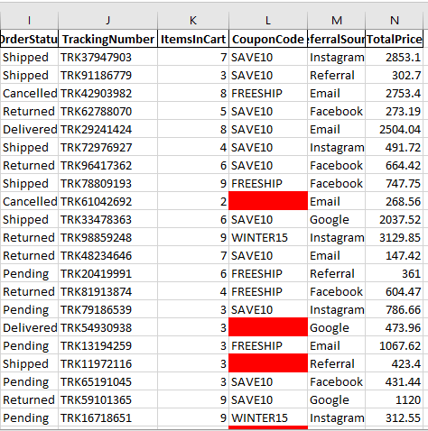
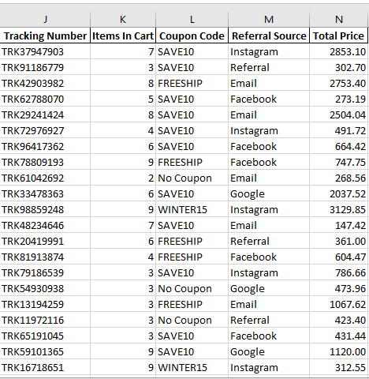
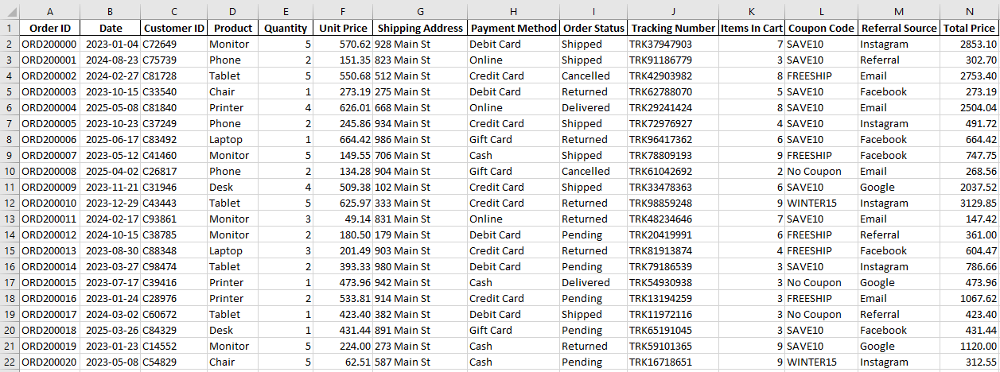

# DecodeLabs Data Analytics Internship

This repository contains the projects and technical assignments I completed during the DecodeLabs Data Analytics Internship. The projects demonstrate my skills in data cleaning, data analysis, and data visualization using Microsoft Excel, SQL, Power BI, and other analytics tools.

## Projects

### 1. E-commerce Order Data Cleaning

**Tool Used:** Microsoft Excel

#### Project Overview

This project involved cleaning an e-commerce order dataset containing **1,200 rows** and **14 columns**. The dataset was assessed for common data quality issues to improve its consistency and prepare it for analysis.

#### Data Cleaning Tasks

- Identified and handled missing values in the Coupon Code column.
- Converted the Quantity, Unit Price, and Total Price columns to the correct numeric data type.
- Applied the `TRIM()` function to text columns to remove unnecessary whitespace.
- Checked for duplicate records.
- Validated the Date column to ensure it was correctly formatted.

## Project Screenshots

Below are a few screenshots showing the dataset before and after the cleaning process.

### Dataset Overview

### Missing Values Identified

### Missing Values Resolved

### Final Cleaned Dataset

